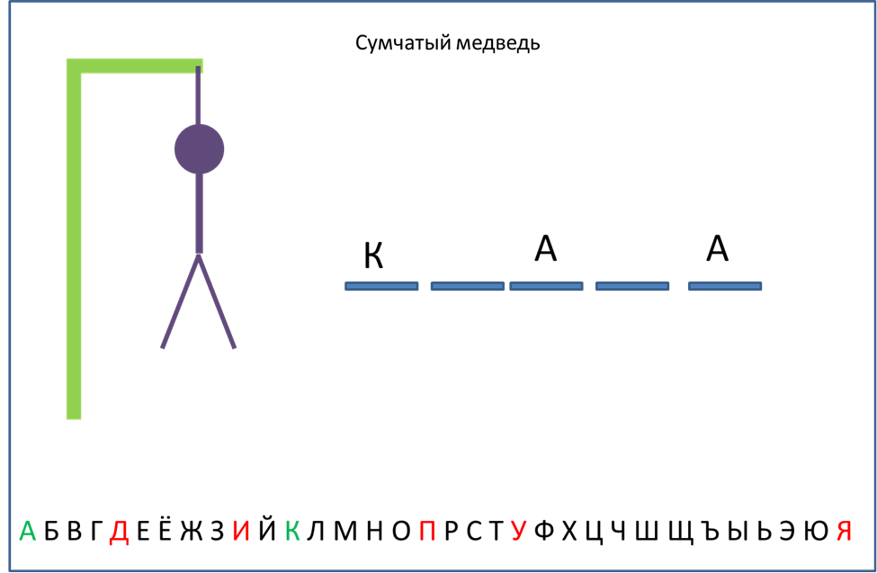
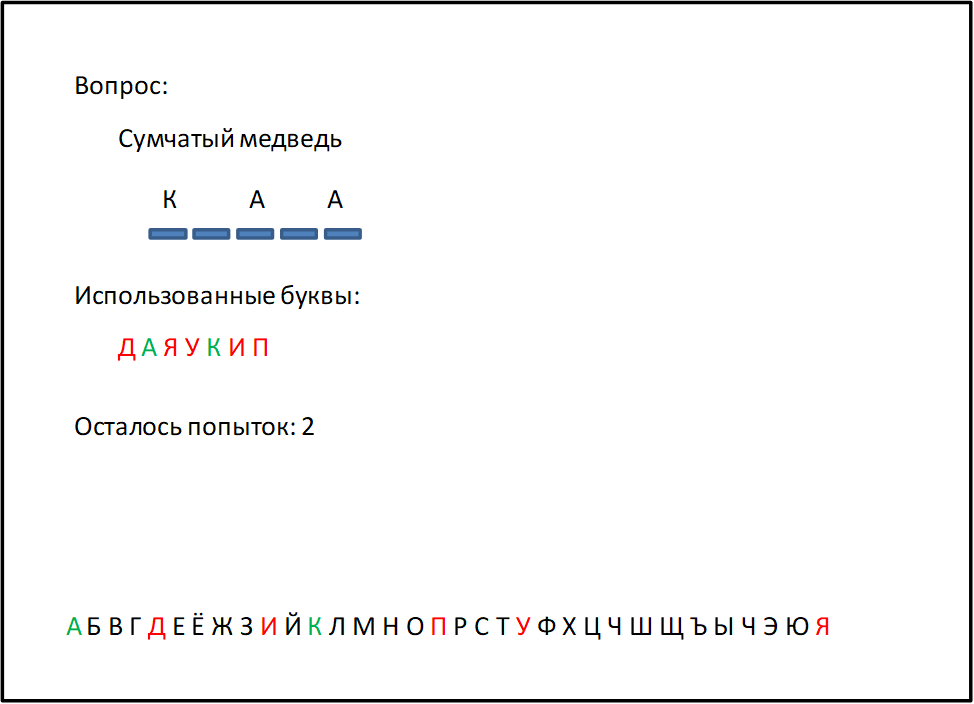

# Лабораторная работа №1

## Задание 1 - 30б

В этом задании для визуализации разрешается использовать произвольные графическое API и UI-framework. Допускается использовать и веб-технологии (HTML, CSS, JavaScript).
Разработайте GUI-приложение, отображающее при помощи векторных примитивов (прямоугольники, многоугольники и другие) Ваши инициалы разноцветными буквами.
Пример визуализации инициалов студента Петра Ильича Чайковского:

## Задание 2 - 60б

В этом задании для визуализации разрешается использовать произвольное графическое API. Разрешается использовать и веб-технологии (HTML, CSS, JavaScript).
Разработайте GUI-приложение графическое приложение, визуализирующее с использованием векторных примитивов картинку на одну из следующих тем:

• Домик в деревне. Домик с крышей, трубой, окном, дверью и забором.

• Троллейбус. Троллейбус с несколькими окнами, колесами, а также токоприемниками, соединенными с проводами.

• Один из героев мультсериала South Park. Постараться соблюсти визуальное сходство с прототипом

• Системный блок компьютера и монитор (вид спереди). У системного блока должен быть виден CD-ROM, кнопка включения и цветные индикаторы (питание, жесткий диск).

• Цветок. У цветка должно быть несколько листьев и лепестков, а также стебель.

• Грузовик (вид сбоку). Кузов, колеса, окна, дверь.

• Космическая ракета.

• Тема по выбору студента. Тема, предложенная студентом не должна уступать по сложности предложенным выше вариантам.

## Задание 4

Разработайте с использованием произвольного графического API и UI-фреймворка компьютерную игру «Виселица».

Суть игры заключается в том, что компьютер загадывает слово и дает игроку некоторую подсказку. Игрок за ограниченное количество попыток должен угадать это слово, называя его по буквам. За каждую неверно названную букву игрок лишается попытки, что графически изображается рисованием новой части тела «висельника» (веревка, голова, тело, нога, нога, рука, рука).

При правильно угаданной букве показываются все ее вхождения внутри слова. Игра заканчивается либо победой игрока при угадывании всех букв слова, либо его проигрышем при исчерпании имеющегося количества попыток. Примерный вид экрана программы показан на рисунке:

Выбор букв осуществляется игроком при помощи мыши. По окончании игры пользователю показывается сообщение с информацией о выигрыше/проигрыше с предложением начать новую игру. При утвердительном ответе программа должна предложить пользователю новое слово, в противном случае программа завершить свою работу.

Правильно угаданные буквы выделяются зеленым цветом, а неправильно угаданные – красным. Программа не должна позволять повторный выбор букв (при их выборе ничего не должно происходить).

Слова и задания должны загружаться программой из внешнего текстового файла (необходимо выбрать подходящий формат для их хранения) и предлагаться пользователю случайным образом.

Бонус до 50 баллов за возможность переключения визуального представления игры

Бонус начисляется за возможность в любой момент переключаться между основным и альтернативным вариантами визуального представления игрового при помощи меню. Состояние игры при этом изменяться не должно. Пример альтернативного способа визуализации

