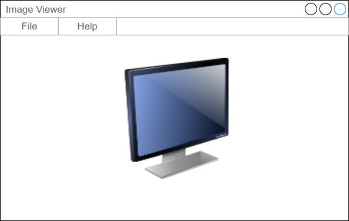

# Лабораторная работа №2

## Задание 1. 50 баллов

Разработайте приложение для просмотра растровых изображений. При помощи меню File -> Open должен открыться стандартный диалог выбора файла. Должна поддерживаться возможность открытия хотя бы одного из стандартных типов файлов изображений: PNG, JPEG, BMP. Для файлов формата PNG-файлов должна поддерживаться полупрозрачность (под изображением нарисуйте просвечивающую сквозь него подложку, например, в виде шахматной доски).

При изменении размеров окна изображение должно центрироваться в клиентской области окна. За пределы окна изображение выходить не должно – при нехватке места оно должно ресайзиться с сохранением оригинальных пропорций.
