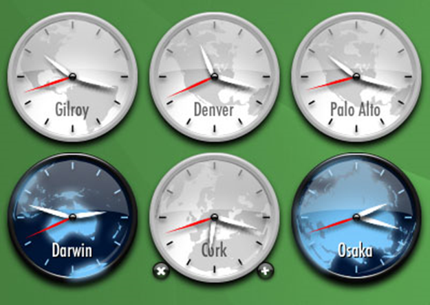

# Лабораторная работа №3

## Задание 1

Разработайте приложение, инициализирующее OpenGL любым доступным вам способом. Приложение должно визуализировать график одной из следующих функций на заданном интервале.
График должен включать в себя координатные оси X и Y, оформленные в виде стрелочек с нанесенными на них делениями (цену делений подберите такой, чтобы на экране помещалось не менее 10 делений по каждой из координатных осей), а также сам график, точки которого соединены ломаной линией с шагом, обеспечивающим достаточно гладкий вид линии графика.
Цвет графика должен отличаться от цвета координатных осей.
При изменении размеров окна график должен помещаться внутри окна, сохраняя свои оригинальные пропорции.

### Вариант 2 – Парабола – 10 баллов

y=2x^2-3x-8 на интервале x∈[-2;+3]

## Задание 2

Разработайте OpenGL-приложение, визуализирующее с использованием векторных примитивов OpenGL двухмерную картинку, соответствующую одному из перечисленных ниже вариантов.

• Приложение должно использовать режим двойной буферизации и не должно мерцать при изменении размеров окна, а также в случае анимации

• При изменении размеров окна должно сохраняться соотношение сторон объектов. Например, круги не должны превращаться в эллипсы. Достичь этого можно, настроив матрицу ортографического проецирования соответствующим образом.

Фотографического сходства достигать не требуется: все-таки дисциплина связана с программированием, а не с рисованием. Для решения поставленной задачи можно найти подходящее растровое изображение в Интернет и выполнить его аппроксимацию с помощью векторных примитивов OpenGL. Тем не менее, будет оцениваться качество исполнения результирующей картинки.

Для сокращения объема программного кода спроектируйте необходимые классы для представления, параметризации и визуализации графических примитивов более высокого уровня из примитивов Open GL и используйте их для построения изображения. Весьма полезной может оказаться возможность загрузки информации об изображении из внешнего файла, в котором были бы записаны команды рисования высокоуровневых примитивов. Это избавит от необходимости перекомпиляции приложения после каждой правки.

Обращайте внимание на расширяемость программы и лёгкость её модификации. Например, структура программы должна вам легко позволять нарисовать не один, а несколько экземпляров изображения в разных масштабах и разном месте окна. Разные экземпляры картинки могут отличаться не только размером, но и цветом отдельных частей.

### Вариант 7 – Аналоговые часы – 50 баллов

Цифры на циферблате (при их наличии) должны быть нарисованы при помощи примитивов OpenGL. Часы должна показывать текущее время (часы, минуты, секунды), совпадающее со временем на компьютере пользователя.

